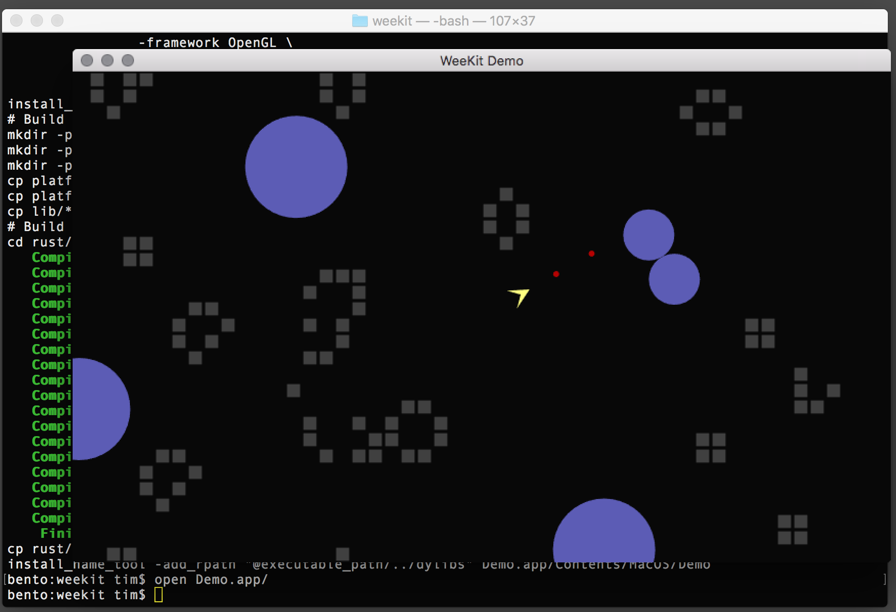

WeeKit is a tiny toolkit for writing interactive applications in Rust.

Initially built to support Raspberry Pi and macOS, WeeKit wraps the OpenVG
library in a Rust interface, adds higher-level drawing functions on that OpenVG
base, and uses platform-specific C libraries and system calls to support
interactive touch-, mouse-, and keyboard- based applications.

WeeKit is a side project, a work in progress, and a learning exercise in Rust,
so you're likely to find it very incomplete. But feel free to join in the fun!

## Copyright

Copyright 2018 by [the WeeKit Authors](AUTHORS.md).

## License

Released under the [Apache 2.0](LICENSE.txt) license.

## Rust Version

WeeKit is tested with Rust 1.26.2.

The easiest way to get Rust is to install it with [rustup](https://rustup.rs).

# WeeKit on Raspberry Pi

## Dependencies

On Raspberry Pi, WeeKit requires `clang` and `libjpeg-dev`. Install them with
the following:

```
% sudo apt-get install clang libjpeg-dev -y
```

## Hardware Configuration

On Raspberry Pi, the touchscreen is assumed to be at `/dev/input/touchscreen`
and the keyboard at `/dev/input/keyboard`.

To map the 7" touchscreen, create the following file:

```
$ cat /etc/udev/rules.d/70-touchscreen-raspberrypi.rules
KERNEL=="event*",ATTRS{name}=="FT5406 memory based driver",SYMLINK+="input/touchscreen",MODE="0440"
```

To map the keyboard, create the following file:

```
$ cat /etc/udev/rules.d/80-keyboard.rules
KERNEL=="event*",ENV{ID_INPUT_KEYBOARD}=="?*",SYMLINK+="input/keyboard",MODE="0440"
```

After rebooting, you should find `/dev/input/touchscreen` and
`/dev/input/keyboard`.

## Make on Raspberry Pi

To build with `make`, link `Makefile.pi` with `ln -s Makefile.pi Makefile`.

## How it works

On Raspberry Pi, WeeKit applications are built as standalone binaries that
include additional platform-specific C code that is built and linked into the
application. Originally this code also included the main WeeKit event loop, but
now that is fully written in Rust.

# WeeKit on macOS

## Dependencies

On macOS, WeeKit uses the
[AmanithVG SDK](https://github.com/Mazatech/amanithvg-sdk.git) for OpenVG
support. Download it into the [third-party](third-party) directory by running
[third-party/RUNME-MACOS.sh](third-party/RUNME-MACOS.sh) in
[third-party](third-party).

WeeKit on macOS also requires [libjpeg](https://en.wikipedia.org/wiki/Libjpeg).
We build it from source downloaded from the
[Independent JPEG Group](http://www.ijg.org/) and currently use
`jpegsrc.v9c.tar.gz`, available in the [files](http://www.ijg.org/files) area.

## Make on macOS

To build with `make`, link `Makefile.macOS` with
`ln -s Makefile.macOS Makefile`.

## How it works

On macOS, WeeKit applications are built as binaries to be placed in a macOS
application bundle. After the application binary is built (using `cargo`), a
script constructs the application bundle. Currently this is coordinated by
`Makefile.macOS`. `cargo` builds also compile platform-specific helper functions
in C and Objective-C that include a Cocoa main event loop. WeeKit applications
are called from this event loop using exposed functions with C linkage that call
functions of the WeeKit Application trait.

# Examples

The [examples](examples) directory contains a few examples. One of the more
interesting ones is [rocks](examples/rocks), a simple Asteroids-style arcade
game that runs on macOS and Raspberry Pi.

To build on macOS, make sure that you've made `Makefile` link to
`Makefile.macOS`, and then use `make rocks` to build the rocks application,
which you can then run from the command-line with `open Rocks.app`.


